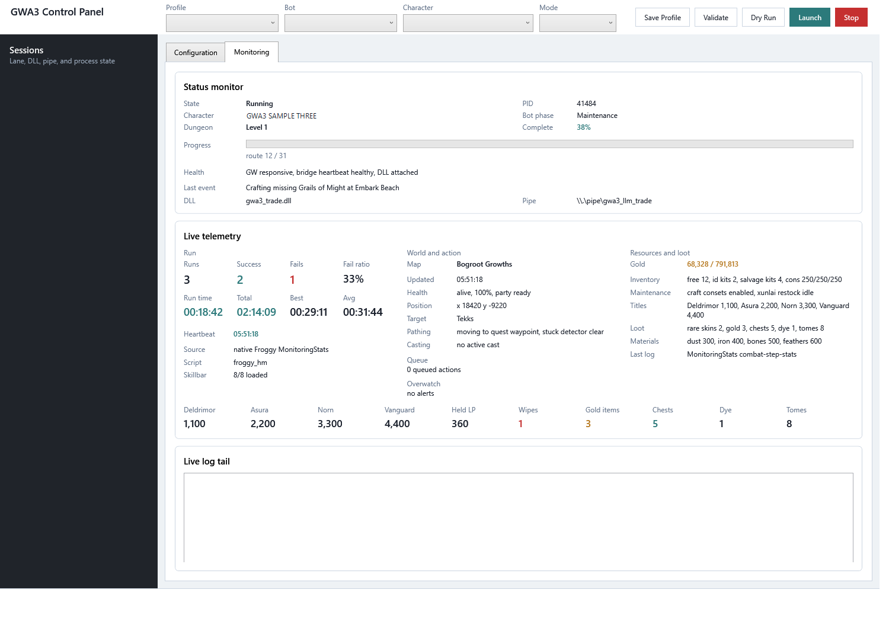

# GWA3

GWA3 is a native C++ Guild Wars automation library and DLL. It provides typed APIs for game memory access, packet dispatch, manager-level game operations, LLM bridge snapshots/actions, and reusable dungeon bot support.

This public repository is a filtered export of the private development tree. It intentionally excludes private account launchers, credentials, local coordination docs, machine-specific paths, and live lane harnesses.

## Demo




## Layers

- `include/gwa3/` and `src/gwa3/`: core GWA3 headers and implementation.
- `include/gwa3/dungeon/` and `src/gwa3/dungeon/`: shared dungeon support built on the core library.
- `bots/`: concrete bot implementations.
- `bridge/`: Python LLM bridge client and public unit tests.
- `ui/`: WPF control panel for profiles, launch planning, and log/status monitoring.
- `tests` and `src/tests`: offline and injected test support.
- `tools/`: injector, signing helper, static analysis runner, and small support utilities.

## Build

Prerequisites:

- Windows with Guild Wars installed.
- Visual Studio 2022 with the Desktop development with C++ workload.
- CMake 3.20 or newer.
- .NET 8 SDK for the UI.
- Python 3.11 for the bridge tests.
- Internet access during the first configure, because CMake fetches MinHook and nlohmann/json.

GWA3 targets the 32-bit Guild Wars client. The included preset uses Visual Studio 2022 with Win32 output:

```powershell
cmake --preset vs2022
cmake --build --preset vs2022 --target gwa3 injector gwa3_dungeon_tests gwa3_tests
```

Release outputs are written under `build/bin/Release/`.

## Tests

```powershell
.\build\bin\Release\gwa3_dungeon_tests.exe
.\build\bin\Release\gwa3_tests.exe
python -m unittest bridge.tests.test_o_protocol_contract bridge.tests.test_o_token_budget
dotnet test ui\Gwa3.UI.sln -c Release
```

Injected/live tests require a running Guild Wars client and should be treated as operator-controlled validation, not CI-safe unit tests.

## Injection

Build the DLL and injector first. Then launch Guild Wars, choose the character you want to run, and inject into that exact Guild Wars process.

The injector selects by process ID. If multiple Guild Wars clients are open, list them first:

```powershell
.\build\bin\Release\injector.exe --list
```

Run the default bot module by injecting `gwa3.dll` into the chosen PID:

```powershell
.\build\bin\Release\injector.exe --pid <GW_PID> --dll gwa3.dll
```

LLM bridge mode starts the named-pipe bridge without starting the default bot:

```powershell
.\build\bin\Release\injector.exe --pid <GW_PID> --dll gwa3.dll --llm
```

Advisory mode runs the default bot and bridge together:

```powershell
.\build\bin\Release\injector.exe --pid <GW_PID> --dll gwa3.dll --llm-advisory
```

Runtime logs are written next to the DLL, including `gwa3_log_<PID>.txt` and `gwa3_bot.log`.

## Hero Templates

Froggy chooses hero templates from `config/gwa3.ini` when that file exists. Copy `config/gwa3.ini.example` to `config/gwa3.ini`, then set a global default:

```ini
[Settings]
HeroConfig=Standard.txt
```

Or set a character-specific override:

```ini
[HeroConfigs]
Your Character Name=Custom.txt
```

Template files live in `config/hero_configs/`. Each non-comment line is:

```text
hero_id,template_code
```

The actual `config/gwa3.ini` file is ignored by Git so users can keep local character-specific settings out of source control.

## UI

Build and run the WPF UI with:

```powershell
dotnet build ui\Gwa3.UI.sln -c Release
.\ui\Gwa3.UI.App\bin\Release\net8.0-windows\Gwa3.UI.App.exe
```

The included default profile is a public seed. Configure launcher and injector paths for your own Guild Wars setup before live use.
